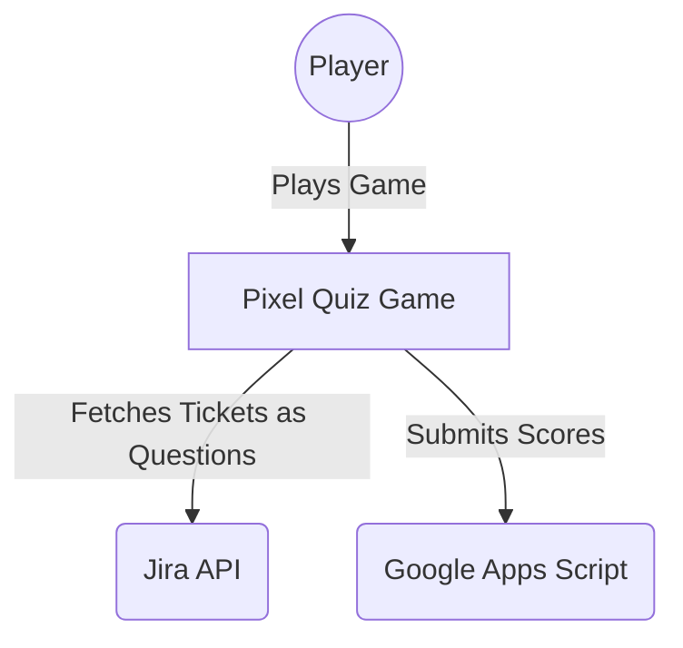
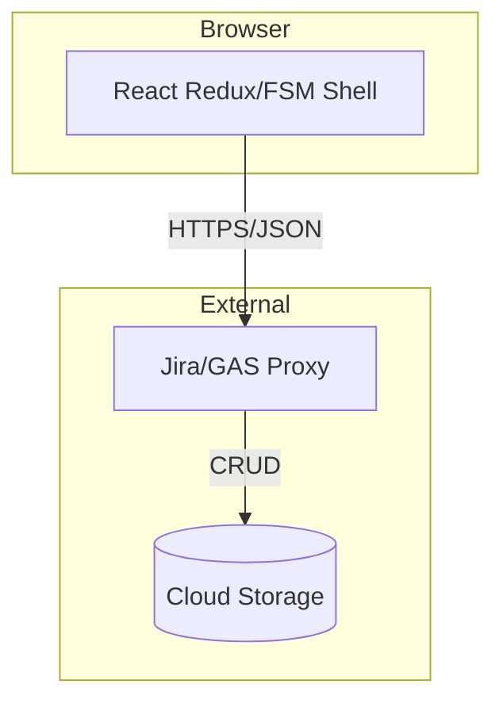
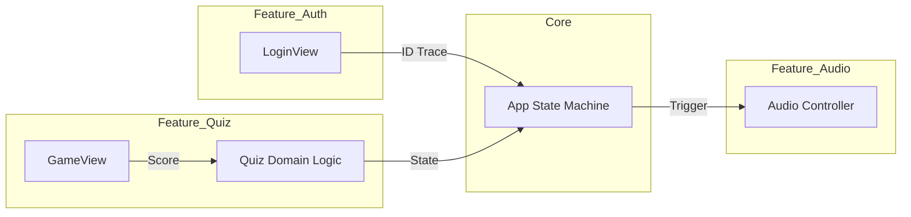
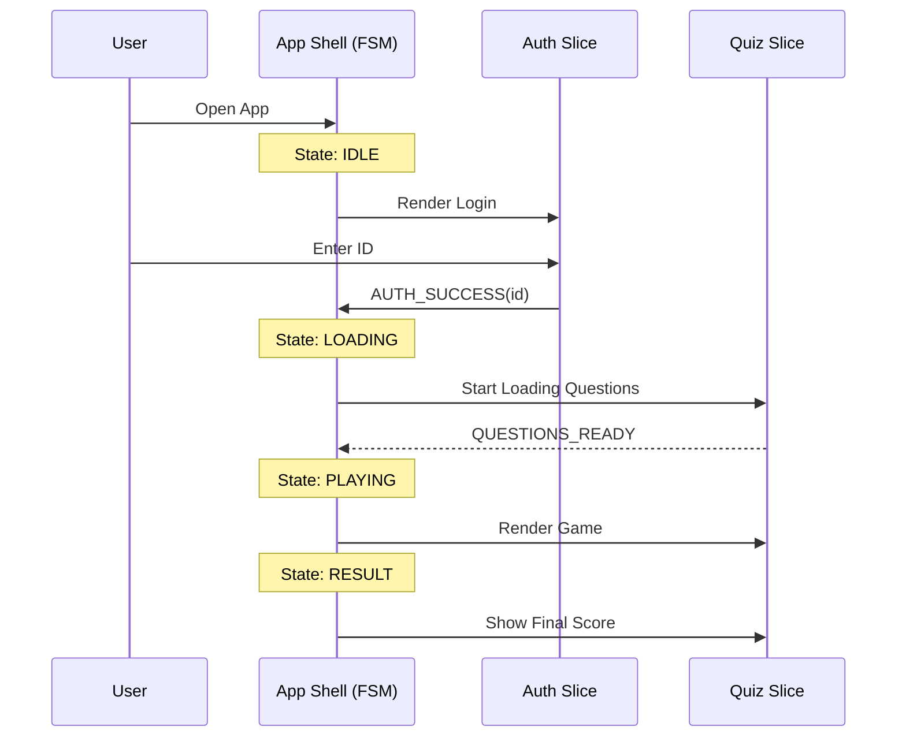

# DESIGN: Pixel Game VSA Refactoring

## 1. Alternative Matrix: Layered vs. Vertical Slice (VSA)

| Metric | Option A: Horizontal Layered (Current) | Option B: Vertical Slice Architecture (Chosen) |
| :--- | :--- | :--- |
| **Scalability** | 2/5 (Fragile context) | 5/5 (Feature isolation) |
| **Maintainability** | 2/5 (High coupling) | 5/5 (Low coupling) |
| **Implementation Speed**| 4/5 (Familiarity) | 3/5 (Initial setup overhead) |
| **Complexity** | 3/5 (Implicit) | 4/5 (Explicit boundaries) |

**Justification**: VSA allows the Agent to focus on a single feature context, reducing architectural regression and making feature-based commits atomic and clean.

## 2. C4 Model Diagrams

### L1: System Context

### L2: Container Diagram

### L3: Component Diagram (VSA Focus)

## 3. Key Sequence Diagrams

### Global View State Machine (FSM)

## 4. Bounded Context Definitions & Guardrails
- **Feature Isolation**: Files in `features/auth` MUST NOT import from `features/quiz`.
- **Domain Purity**: `src/domain/` logic MUST NOT import from `react` or `howler`.
- **FSM Guardrail**: Any view transition NOT defined in the `AppReducer` state machine is a bug.
