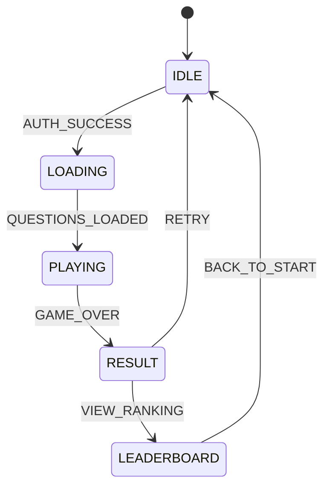

# PRD: Pixel Game Architectural Migration (VSA & DDD)

**Status**: Draft / Pending Review  
**Date**: 2026-03-06  
**Management Path**: `docs/prd/2026-03-06_pixel-game_vsa_refactoring.md`

## 1. Executive Summary
The `pixel-game` is a retro-style quiz engine. Current growth has outpaced the original "horizontal" architecture, leading to high regression risk. This document defines the requirements for a full architectural migration to **Vertical Slice Architecture (VSA)** and **Domain-Driven Design (DDD)**.

---

## 2. User Roles & Success Metrics
### User Roles
- **Player**: The end-user playing the quiz. Expects zero downtime and zero functional regression.
- **Developer/Agent**: The maintainer. Expects clear component boundaries and high testability.

### Success Metrics
- **Mean Time to Recovery (MTTR)**: Reduced by 30% due to feature isolation.
- **Onboarding Speed**: New features can be added by looking at ONLY one directory.
- **Domain Coverage**: 100% unit test coverage for score and game logic.

---

## 3. User Journey Map
Using the refactored architecture, the user journey flows through independent feature slices.

```mermaid
userJourney
    title Player Quiz Journey
    section Authentication
      Open App: 5: Player
      Enter ID: 4: Player
      Identity Verified: 5: System
    section Quiz Gameplay
      Fetch Questions: 5: System
      Answer Question: 4: Player
      Score Calculation: 5: System (Domain)
    section Result & Ranking
      Submit Score: 5: System
      View Leaderboard: 4: Player
```

---

## 4. Product Interaction Flow (State Machine)
The core interaction is governed by a Finite State Machine (FSM) in the App Shell.



---

## 5. UI/UX High-Fidelity Mockup
The refactoring supports a premium, modular UI experience.


*Figure 1: High-fidelity mockup representing the decoupled, feature-driven UI.*

---

## 6. Acceptance Criteria (AC)
- [ ] **Structural Alignment**: All source files moved to `src/features/` (auth, quiz, ranking, audio).
- [ ] **Isolation**: No cross-feature imports without crossing the `shared/` or `core/` gateways.
- [ ] **FSM Enforcement**: `App.tsx` state transitions managed via a formal Reducer/FSM; no ad-hoc `useState` for views.
- [ ] **Testability**: `src/domain/` logic contains 0% React dependencies and 100% test coverage.
- [ ] **Visual Parity**: Layout and CSS themes remain 100% consistent with the original design.
- [ ] **Documentation Trinity**: Every feature slice must have a corresponding entry in `DESIGN.md` and `ARCH.canvas`.

---

## 7. Non-Functional Requirements
- **Consistency**: All PRDs for this project MUST reside in `docs/prd/`.
- **Naming**: Filename pattern: `YYYY-MM-DD_feature_name.md`.
